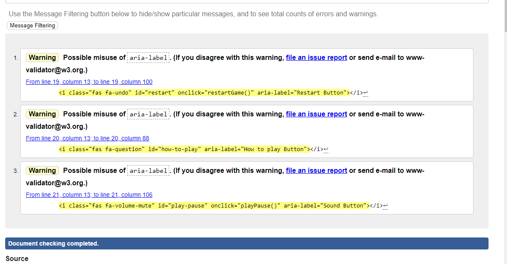
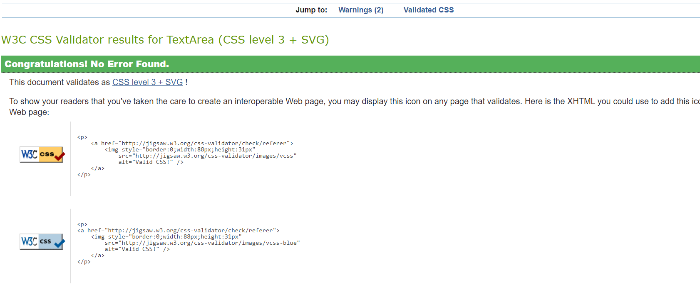
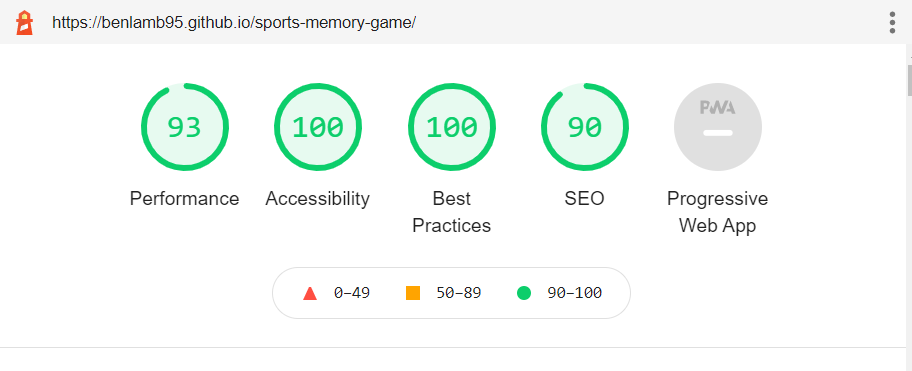

# Welcome to my second project!

Here I have created a memory game which is suitable for everyone. The aim of the game is to attract casual players, who wish to have an enjoyable and fun experience. 

This game intends to have no competition as it is simply there for people to play when they are bored or when then have a spare 5/10 mins on their lunch break at work. The sports nature is incorporated within the selection of music to make it relaxing yet uplifting and positive.  Please Enjoy 😃

## Final Design

## CONTENTS

* [UX/UI](#ux)
    * [USERSTORIES](#user-stories)

* [FEATURES](#features)
  * [Audio](#audio)
  * [COLOURS](#colours)
  * [FONT](#font)

* [TESTING](#testing)
  * [DEVICES](#devices)
  * [VALIDATORS](#validators)
  * [LIGHTHOUSE](#lighthouse)

* [SOLVED BUGS AND ERRORS](#solved-bugs-and-errors)
   
* [UNSOLVED BUGS AND ERRORS](#unsolved-bugs-and-errors)

* [Linking To User Stories](#linking-to-user-stories) 

* [Tools Used](#tools-used)
    * [PROGRAMS USED](#programs-used)
    
* [DEPLOYMENT](#deployment)

* [Credits](#credits)

* [Media](#media)

---

## UX

* To be fun
* The game to be easy to use
* To be able to understand how the game works
* To be given feedback both visually and via audio
* To be well presented 
* To be colourful
* To be suitable for devices across all sizes
---
### Game Goals
* To show case my HTML, CSS and JavaScript knowledge

## User Stories 
* As a user I want the game to be fun
* As a user I want it to be easy to navigate
* As a user I want a game that is relaxing
* As a user I want the audio to be relevant and enjoyable
* As a user I want the game to be eyecatching
---

## Features
The game consists of one page only, however has Modals that pop up when clicked or when the game is over. 

The top of the game contains the game Logo along with the game name. The icons below that all have hover effects to ensure the user knows that they are about to click on that icon. The left icon resets the full game, the question mark produces a how to play modal and the sound icon allows the user the play music. 

The how to play Modal is a simple design which has a title explaining what this modal is and step by step instructions. Next to the title is a close icon which when hovered turns red; again enforcing to the user this is being selected.

This section of the game shows the current time of the round, the current moves and the last time the user got. The current time does have a slight delay when counting up however. The total moves increments by one when the user has flipped over 2 cards which would signify 1 go. The last time saves the users previous round.

The memory game itself is a 4 by 4 sqaure with cards evenly seperated. The cards hve a border and rounded edges to resemble a card style as sort. The cards also have a hover effect again reiterating to the user they are slecting that particular card. When the card has been clicked it has a depress animation. The cards will then 'flip'with a audio cue to make it sound realistic.

Matched cards are kept visible on the board to help users with knowing which card has correctly been identified. All cards face value have a white background with a character playing a certain sport. It was important to keep the background white and use similar characters to make the game a little more challenging based on the size of the game.

A very simple footer with an external link to my main Git Hub page. Link has the same hover effect as the game Info section and the page is opened in an external tab.

Finally, once the user has successfully matched all 16 cards a win modal will be presented. The background audio (if selected by the user) will stop and a congrats style audio will play. The modal again is very simplistic with a trophy that 'shakes' left to right and this will do this until the user clicks off the modal. There is a play again button which will reload the game. Again the button has a simple hover effect.

### Audio

As mentioned throughout the features section there are 4 pieces of audio within the game. The background music which is chilled but also upbeat; a flip effect, a match noise which will enforce to the user two cards have successfully matched and finally the winning audio.

## Colours

My game has three main clours present throughout the site; Green, white and black. The green background has a linear gradient effect which takes the shade of green from lighter to darker. I feel this makes it more attractive than simplying having 1 shade of green but not too distracting from the main purpose which is the game. I have used black and white as has a very good contrast. 

## Font

The font I selcted was Architects Daughter from Google fonts with a backup of cursive. I really liked the font as it was quite funky but still kept its readability; perfect for a game environment. 

---

## TESTING

### Devices

* I have tested my website on the following devices:

  * Apple
    * iPhone X
    * iPhone 8 plus
    * iPhone 11 Max
    * iPhone 13 Max
    * iPad Pro
    * Mac Book 

  * Laptops/Desktops
    * Dell Inspiron 15 5000
    * HP Pavilion 14
    * LG Display screen 32inch

  * Browsers
    * Chrome
    * Edge
    * Safari
    * Firefox

---

## Validators

** Final validator result above.
* Initially I had only a small number of errors within my HTML. Some were due to not closing body tag and one was a missues of 'type'.

** Final validator result above
* One error within CSS validator was from using more than one argument within margin-top.

** Final validator result above
* My JavaScript validatior didnt throw up any errors however there was warnings in regards to missing semi-colons which was resolved.
* I also included a return before my ternary operator.
* There are still three warnings left; however I have tried resolving this issue with no luck without causing my game to break. 

---
## Lighthouse

## Tools Used

* [HTML](https://en.wikipedia.org/wiki/HTML5)
* [CSS](https://en.wikipedia.org/wiki/CSS#CSS_3)
* [JavaScript](https://en.wikipedia.org/wiki/JavaScript)
* [Jquery](https://learn.jquery.com/)

## Programs Used

* GITPOD
  * The IDE to code this site.
* GITHUB
  * Used to store repositories.
* Favicon Generator

  ---

  ## DEPLOYMENT

* This site was deployed through GitHub pages. To do so follow the below steps:
  * In the GitHub repository click on the settings tab
  * Within the drop down menu you should find Pages (located second from bottom) 
  * Within the source section drop down menu change this to master branch and ensure root is selected. Then press save
  * This should prompt a ribbon to indicate the site has succesfully been deployed.
  
## Cloning this project
If you want to work further on my project, go ahead and clone it following these steps:

1. Go to the top of the [BenLamb95/sports-memory-game](https://github.com/BenLamb95/sports-memory-game) repository.
2. Click the button named 'Code' next to the green 'Gitpod' button.
3. Choose HTTPS and copy the URL by clicking the icon next to the URL.
4. Open Git Bash/Terminal and change the current working directory to the location where you want the cloned directory.
5. Type 'git clone' and then paste the copied URL.
6. Press 'Enter'.

To get to the source of this information: [Click here!](https://docs.github.com/en/free-pro-team@latest/github/creating-cloning-and-archiving-repositories/cloning-a-repository)

---

## Credits
* Free Code Camp Memory card game tutorial [Youtube](https://www.youtube.com/watch?v=ZniVgo8U7ek) for the memory card layout.
* Scotch Memory Game (https://scotch.io/tutorials/how-to-build-a-memory-matching-game-in-javascript#toc-3-moves)
* Marina Fereira Memory Game (https://marina-ferreira.github.io/tutorials/js/memory-game/)
* Sandra Israel (https://sandraisrael.github.io/Memory-Game-fend/)
* Code Institute
* W3 Schools 
* MDN Web Docs
* Stack Overflow
* Learn JQuery (https://learn.jquery.com/)
* Learn JQuery (https://unclebigbay.com/difference-between-vanilla-javascript-and-javascript-explained)
* How to play audio files(https://www.delftstack.com/howto/javascript/play-audio-javascript/)
* Youtube how to play audio (https://www.youtube.com/watch?v=wffK2OIt8u0)

## Media

* Card images (front and Back) came from FreePik which allows free downloads
* Fontawesome Icons
* Google Fonts

## Audio 
* Card Flip - FreeSound
* Match - FreeSound
* Background Music - Bensound
* Winner Music - Mixkit